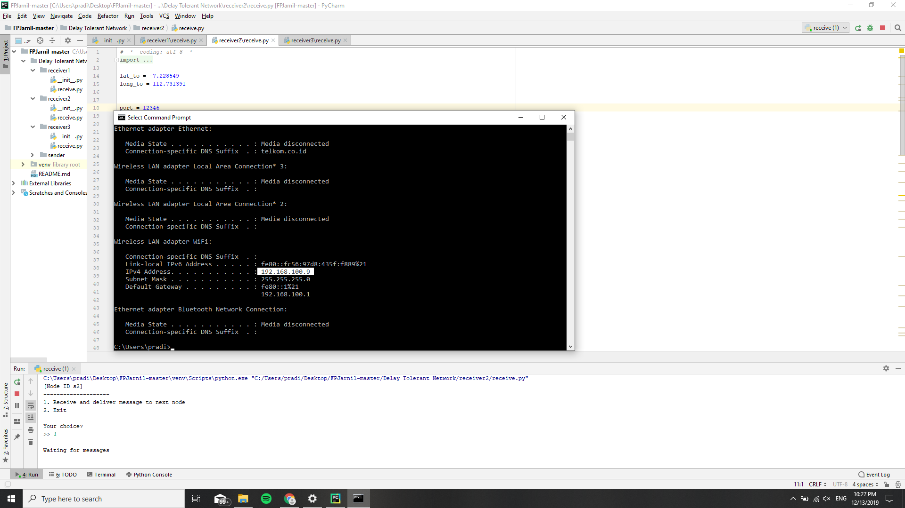
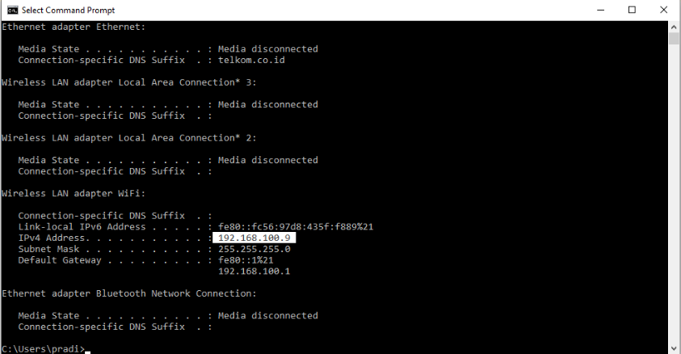
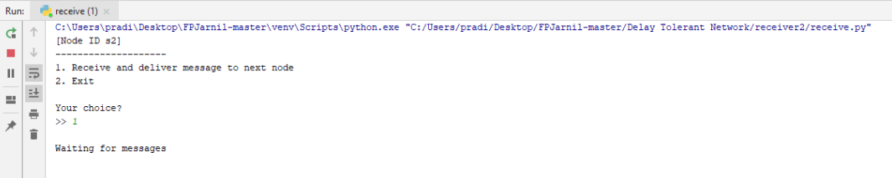
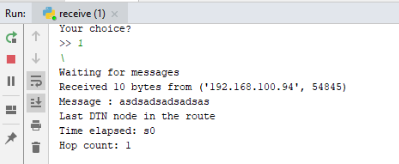
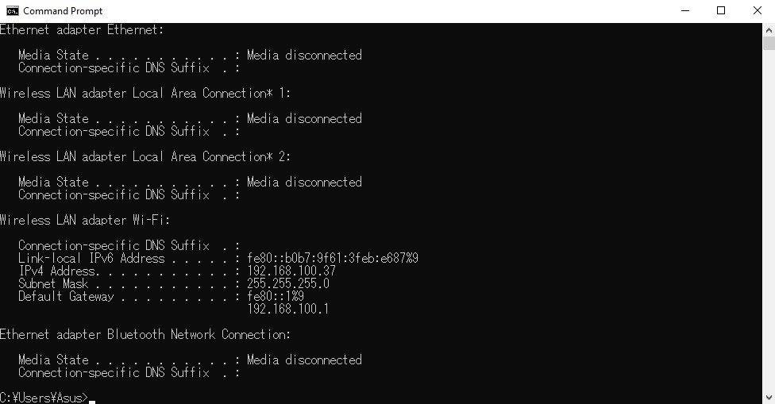
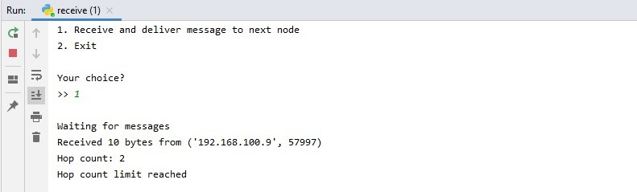
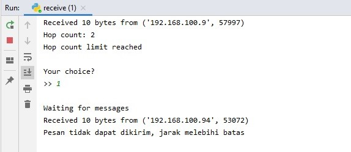

# Final Project Jaringan Nirkabel
### Kelompok 9
### Anggota kelompok:
1. Akmal Darari Rafif Baskoro **05111640000148**
2. Naufal Andira Perdana **05111640000150**
3. Falah Ath-Thaariq Razzaq **05111640000151**
4. Achmad Hanif Pradipta **05111640000154**

### Cara Kerja:
1. Pastikan berada di jaringan yang sama (dan lebih baik firewall dimatikan)
2. Jalankan send dan receive di masing2 komputer yang berbeda
3. Untuk sender, masukkan pesan, destinasi (destinasi node, nantinya keluar ketika menjalankan receive.py), Hop limit, limit waktu, dan limit jarak
4. Untuk receiver, hanya menekan menerima pesan lalu tunggu hingga pesan masuk
5. Selesai

### Dokumentasi:

Receiver menunggu masuknya data input dari sender

Lalu sender dengan IP 192.168.100.94 akan mengirimkan pesan yang akan diterima oleh receiver, lalu ini adalah hasil yang di terima oleh receiver

Ketika hop dan jarak melebihi batas receiver 2, nanti akan muncul pesan seperti ini. Untuk kasus yang ini, dilakukan di komputer yang berbeda

Ketika mencoba mengirim pesan yang sudah melampaui batas jarak, seperti inilah tampilan receivernya (Untuk kasus ini, ketika pesan yang dikirim oleh 192.168.100.94 melebihi batas)

